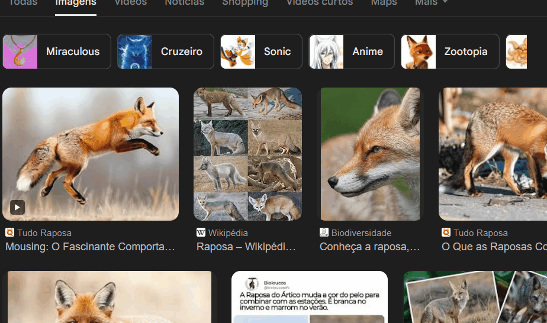
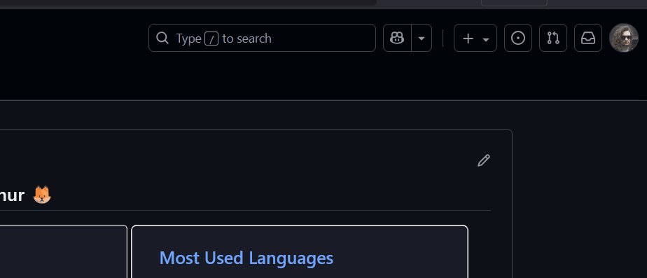
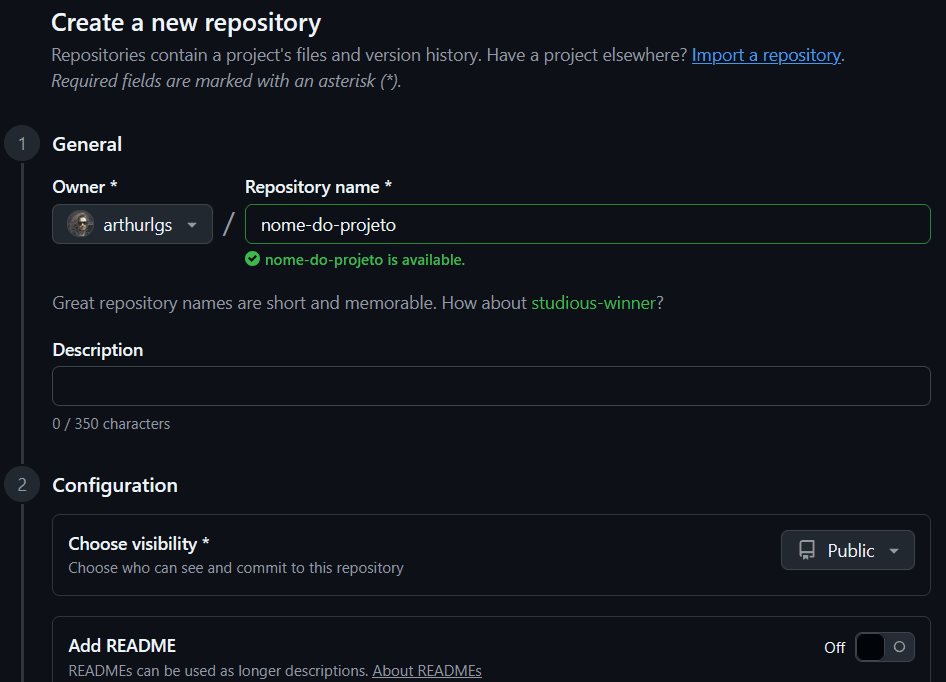
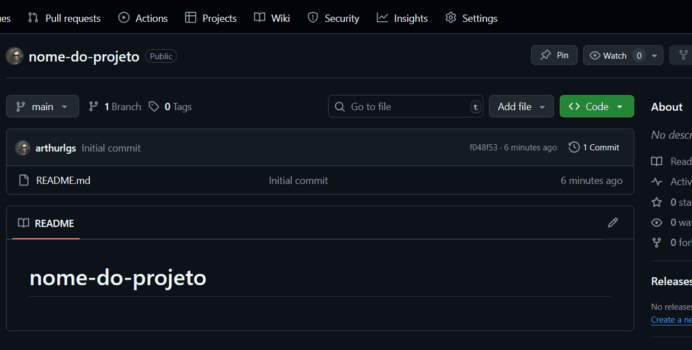
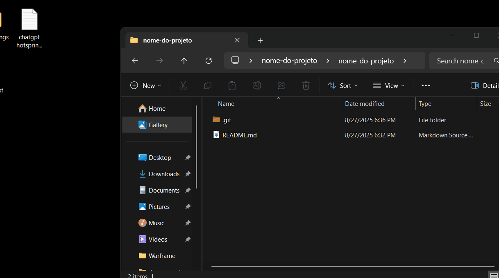

<h1 align="center">Projeto com README</h1>

Um projeto de teste com um arquivo README, com instruções e gifs demonstrativos.

   

## Tecnologias utilizadas
- HTML

## Como fazer você também

1. Criar um novo repositório no Github

   

2. Adicionar um arquivo `README.md` 

   

## Após, clonar o repositório

3. Usar **git clone**

   

4. Abrir com VS Code

   

## Agora é só editar como desejar!!!