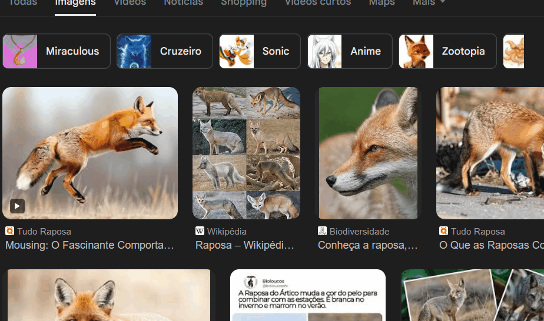
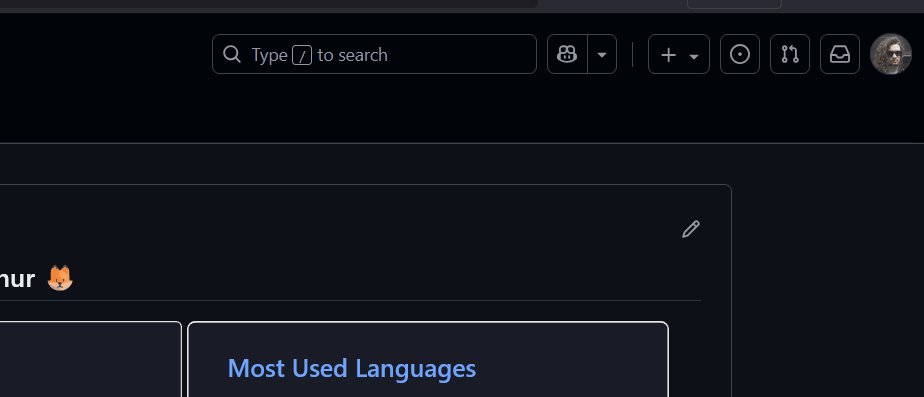
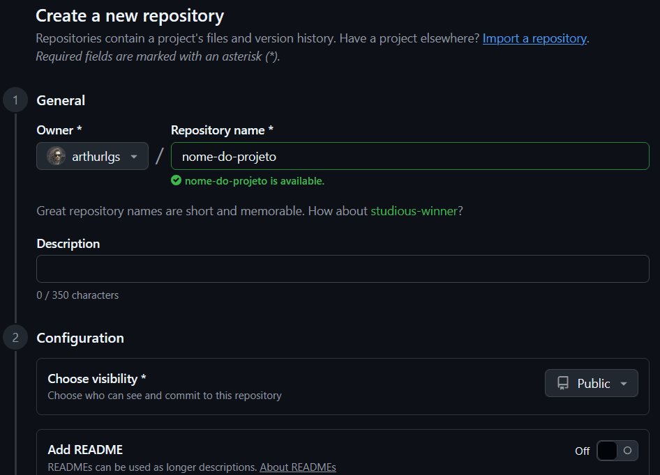
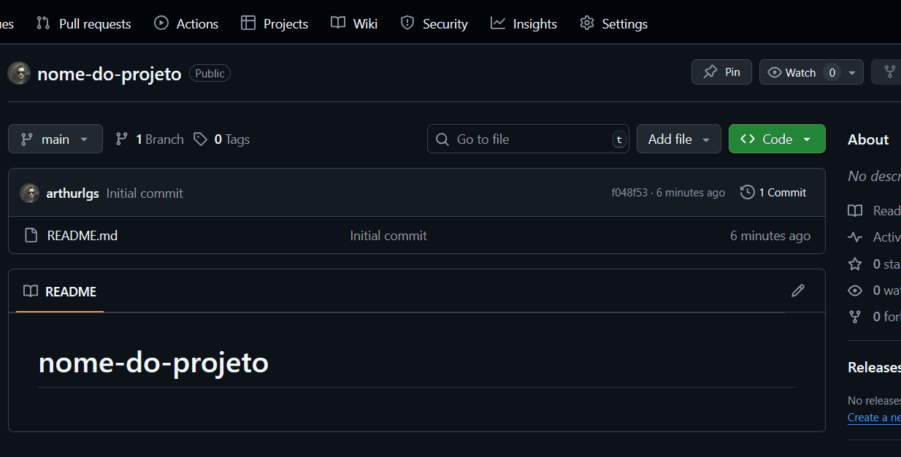
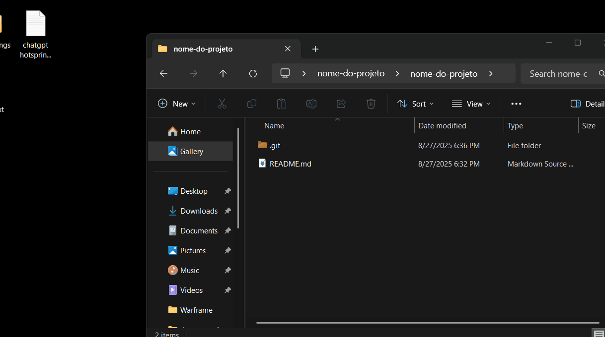

# Projeto com README
Um projeto de teste com um arquivo README 🦊

## Tecnologias utilizadas
- HTML

## Como fazer você também

1- Criar um novo repositório no Github

2- Adicionar um arquivo README.md 

## Após, clonar o repositório

3- git clone

4- Abrir com VS Code

## Agora é só editar como desejar!!!